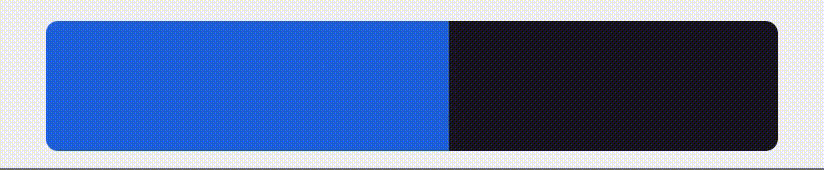

# 🎚️🤏 react-native-swipe-slider 📦

[](https://www.npmjs.com/package/react-native-swipe-slider)


iOS brightness-style slider ready to use in your next React Native app.

## 📥 Installation

`npm install react-native-swipe-slider`

or

`yarn add react-native-swipe-slider`

## 👀 Demo



## 💈 Example

Please check out this [Expo Snack](https://snack.expo.io/@tomekkleszcz/react-native-swipe-slider-example).

## 🧰 Usage

```
import {useState} from 'react';
import SwipeSlider from 'react-native-swipe-slider';

const Component = () => {
    const [value, setValue] = useState(0);
    
    return (
        <SwipeSlider
            style={{flex: 1, width: 65}}
            min={0}
            max={100}
            value={value}
            onChange={value => setValue(value)}
            backgroundColor={'#1B1725'}
            barColor={'#226CE0'}
            vertical
        />
    );
}
```

### Available props

* `min` - The minimum permitted value.
* `max` - The maximum permitted value.
* `step` (optional) - The stepping interval.
* `value` - Slider value.
* `onChange` (optional) - Function which would be called when user stops touching the slider.
* `changeEventThrottle` (optional) - This prop controls how ofter the change event will be fired while changing the value of the slider (as a time internal in ms). If it is not set `onChange` event would be fired only when user stops swiping the slider.
* `vertical` (optional) - Slider orientation. Defaults to `false`.
* `backgroundColor` - The slider background color (navy blue in the demo).
* `barColor` - The bar color (blue in the demo).
* `style` (optional) - Slider style.
* `barStyle` (optional) - Bar style.
* `children` (optional) - It could be used to place elements inside the slider (eg. an icon).
